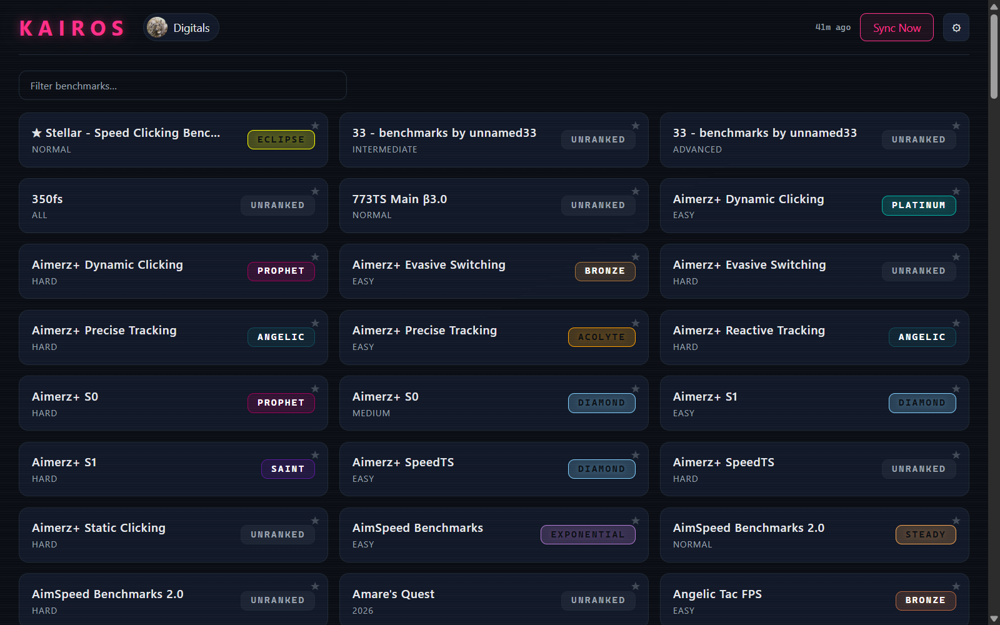
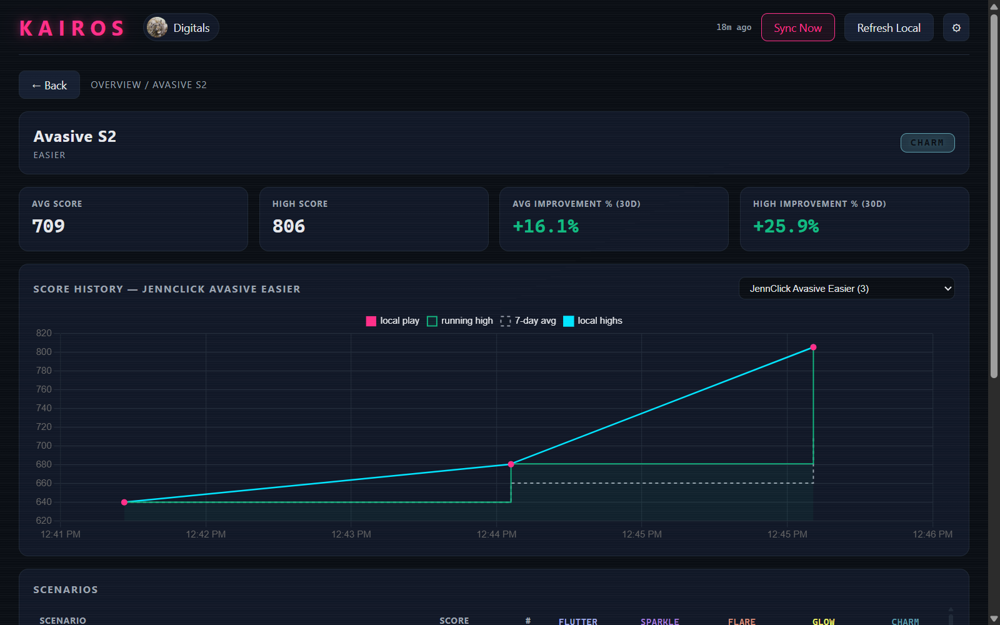

# Kairos

[](https://github.com/Digitals06/kairos/actions/workflows/ci.yml)

A desktop companion for [KovaaK's FPS Aim Trainer](https://store.steampowered.com/app/824270/KovaKs/): track every benchmark, watch ranks climb, and see per-scenario improvement over time — all in a neon-soaked native app. No login, no accounts, your data stays in a local file on your PC.

If Kairos helps your grind, consider supporting development:

[](https://ko-fi.com/Q2S1237A82)



## Features

- **evxl-accurate ranks, computed locally** — the rank engine reverse-engineered from evxl.app recomputes your rank from your scores (all major benchmark families: Voltaic energy, harmonic/top-N/count-based methods, …). The server's own rank is only a fallback, because it's wrong for most benchmarks.
- **Rank-change toasts** — every sync diffs the two newest snapshots per benchmark; when your overall rank moves, you get a "RANK UP" toast with the old and new tier.
- **Live local plays** — a background watcher reads KovaaK's `Stats` folder while the app is open: new sessions appear in charts on their own, no refresh click. (Ranks still update on Sync Now.)
- **Full benchmark coverage** — every benchmark tracked on [evxl.app](https://evxl.app) (Voltaic, Revosect, PureG, Aimerz+, …), with official rank names and colors.
- **One-click sync** — a quick pass for your main benchmarks, plus a Deep Scan for everything. If the server throttles, Kairos waits and retries politely on its own. **Refresh Local** re-scans the stats folder without touching the network.
- **Per-scenario detail** — score history chart (your local plays + sync snapshots, deduplicated so the same run never counts twice), 7-day average, running high, avg/high scores, and 30-day improvement % for the selected scenario. Snapshots that don't set a new high are ignored, so stale syncs never pollute charts or averages.
- **Search + favorites** — filter the grid by name, pin benchmarks to the top. Pins survive restarts.
- **Private by design** — no accounts, no telemetry; only public APIs, and live API tests skip unless you opt in.



## How it works

| Source | Used for |
|---|---|
| KovaaK's public score server (no login needed) | Scores, ranks, leaderboard positions |
| evxl.app public lookup + built-in registry | Finding your profile, benchmark and rank definitions |
| Your KovaaK's `Stats` folder (`*.csv` files) | Local play history |

Everything is stored in one file: `%LOCALAPPDATA%\kairos\store.db`. Nothing is uploaded anywhere.

## Run it (no building needed)

1. Download `kairos.exe` from the [latest release](https://github.com/Digitals06/kairos/releases).
2. Double-click it, enter your Steam ID (or vanity name / profile link), hit **Sync Now**.

## Build from source (Windows, step by step)

You only need this if you want to change the code. Takes ~10 minutes the first time.

**Step 0 — install the tools** (skip any you already have):

1. **Git**: download from [git-scm.com](https://git-scm.com/download/win), run the installer, keep all defaults.
2. **Rust**: download from [rustup.rs](https://rustup.rs/) and run `rustup-init.exe`. When it asks, choose **Desktop development with C++** if prompted about Visual Studio (Rust needs Microsoft's C++ build tools to link apps on Windows — the installer will point you to them).
3. **Node.js 24**: download the LTS installer from [nodejs.org](https://nodejs.org/), run it, keep defaults. This gives you both `node` and `npm`.

Check they work (open a fresh terminal — search "PowerShell" in Start — and run):

```powershell
git --version
rustc --version
node --version
npm --version
```

Each should print a version number. If a command is "not recognized", close and reopen the terminal (installers update the `PATH` only for new windows).

**Step 1 — download the code:**

```powershell
cd $HOME\Desktop
git clone https://github.com/Digitals06/kairos.git
cd kairos
```

This creates a `kairos` folder on your Desktop with the full source.

**Step 2 — build the frontend** (the visual part; plain Rust builds skip it, so this step is mandatory):

```powershell
cd crates\kovaaks-tauri\ui
npm install
npm run build
```

`npm install` downloads the UI libraries (once), `npm run build` compiles them into the `dist` folder.

**Step 3 — build the app:**

```powershell
cd ..\src-tauri
cargo build --release --features custom-protocol
```

The `--features custom-protocol` part is required: it bakes the built frontend from step 2 into the `.exe`. Without it the app opens to a connection error. The finished app lands at `..\..\..\target\release\kairos.exe` (i.e. `kairos\target\release\kairos.exe` from the repo root).

**Step 4 — run it:**

```powershell
..\..\..\target\release\kairos.exe
```

**Running the tests** (from the repo root folder):

```powershell
cd ..\..\..\   # back to the kairos folder
cargo test --workspace --offline        # fast, no network
cargo clippy --workspace --all-targets -- -D warnings   # linter, CI gate
```

Live API tests exist but are skipped by default (`#[ignore]`) so the suite never hammers the public servers; a few of them read environment variables (`KAIROS_TEST_STEAM_ID`, `KAIROS_LIVE_DB`, `KAIROS_LIVE_STEAM_ID`) and skip cleanly when unset.

## Development workflow

CI runs on every push (rustfmt, clippy with warnings denied, the offline test suite, and a frontend build) and a Windows release build runs automatically on `v*` tags — the exe is attached to the GitHub release by the workflow itself.

Debug/probe scripts are intentionally **not** part of the repo; keep local tooling outside git (`.gitignore` covers `/scripts/`).

## Roadmap

Planned features and quality-of-life work live in [ROADMAP.md](ROADMAP.md) — no dates, just what we intend to build next.

## Layout

```
crates/kovaaks-core/    registry, API clients, SQLite store, sync engine, metrics,
                        rank engine (rankcalc), rank-diff (rankdiff)
crates/kovaaks-tauri/   Tauri v2 shell (src-tauri, incl. the CSV watcher) + Svelte 5 UI (ui)
docs/                   rank-systems spec + README screenshots
```

Built with Rust, Tauri v2, Svelte 5, Chart.js, and rusqlite.
