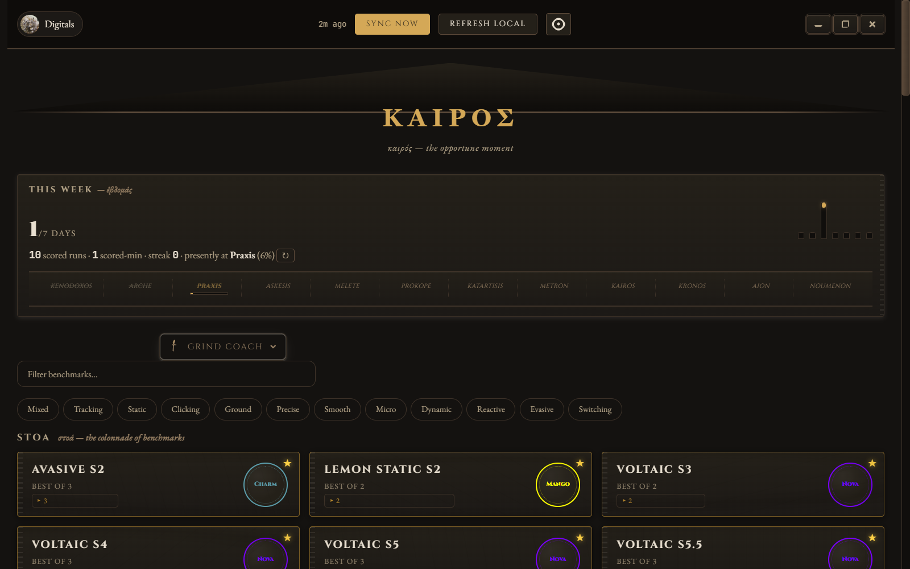
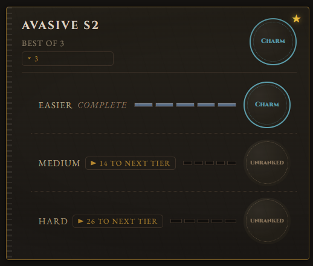
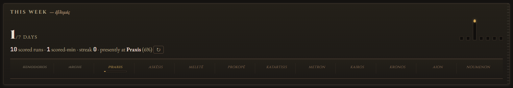
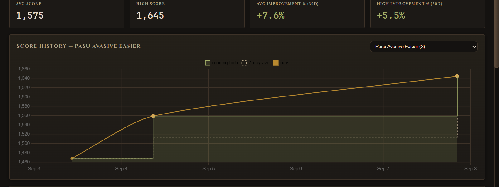
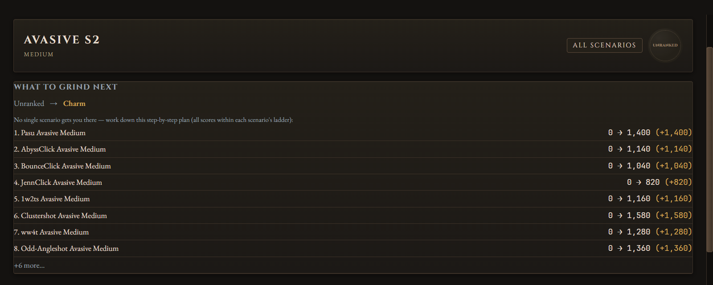

# Kairos — ΚΑΙΡΟΣ

[](https://github.com/Digitals06/kairos/actions/workflows/ci.yml)

A desktop companion for [KovaaK's FPS Aim Trainer](https://store.steampowered.com/app/824270/KovaKs/): track every benchmark, watch ranks climb, and see per-scenario improvement over time — carved into marble and basalt. No login, no accounts, your data stays in one local file on your PC.

*"καιρός — the opportune moment: the exact instant in which you act."*

If Kairos helps your grind, consider supporting development:

[](https://ko-fi.com/Q2S1237A82)



## What's new in v0.3.0 — the temple identity

- **Marble & basalt themes with an OS-follow option** — per-theme chart palettes, frameless window with engraved window glyphs, carved scrollbars, and a UI that scales with the window.
- **Weekly plaque** — plays-per-day torch strip, a Twelve-Steps level frieze, rank inscriptions and scored-min in one "This week" element.
- **Analytics** — per-benchmark scenario analysis with score history charts and 30-day improvement.
- **Grind coach** — pick a family, get the shortest path to your next tier.
- **Two-phase launch** — the grid paints in under 2s; grind chips stream in after, so the app opens instantly.
- **Plain-English UX** — "spread" instead of CV%, human labels throughout.

## Features

### The grind

- **Grind coach** — pick a benchmark family and the coach works out what to play: **▶ N runs to next tier** is the count of scenarios that must improve to flip the rank (0 means maxed), **plateaued** means mid-progress but no new PB in 3+ days, **complete** when every scenario sits at its top rung. Choose a difficulty and the coach plans the grind for it.
- **What to grind next** — on each benchmark's page: the cheapest per-scenario scores that push you to the next rank tier, probed against the local rank engine so they're exact for every method family. Targets are capped at each scenario's ladder top, so they're always actually achievable; when no single scenario can carry you up, the panel produces a numbered step-by-step plan (each step within its scenario's ladder) that reaches the next tier together.
- **Consistency & plateau tags** — grind targets show **spread** (how steady your recent runs are, 0% = identical scores) and flag scenarios stalled without a new personal best, so you can swap a stalled grind for something still climbing.



- **evxl-accurate ranks, computed locally** — the rank engine reverse-engineered from evxl.app recomputes your rank from your scores (all major benchmark families: Voltaic energy, harmonic/top-N/count-based methods, …). The server's own rank is only a fallback, because it's wrong for most benchmarks.
- **Rank-change toasts** — every sync diffs the two newest snapshots per benchmark; when your overall rank moves, you get a "RANK UP" toast with the old and new tier.
- **Live local plays** — a background watcher reads KovaaK's `Stats` folder while the app is open: new sessions appear in charts on their own, no refresh click. (Ranks still update on Sync Now.)
- **Full benchmark coverage** — every benchmark tracked on [evxl.app](https://evxl.app) (Voltaic, Revosect, PureG, Aimerz+, …), with official rank names and colors.
- **One card per family** — the overview groups benchmarks by family: best rank badge, difficulty count, and an unroll that shows every difficulty with its tier-ladder rungs lit up to your rank.

### The numbers



- **Weekly plaque** — actual alive-time per run (scored-min, `hit_count / avg_fps` summed over your week's local plays, labeled honestly never guessed), plays-per-day, current level along the Twelve Steps, and rank changes — in a single plaque.
- **Per-scenario detail** — score history chart (your local plays + sync snapshots, deduplicated so the same run never counts twice), running high, 7-day average, avg/high scores, and 30-day improvement %. Snapshots that don't set a new high are ignored, so stale syncs never pollute charts or averages. Scenario tables cycle **weakest → strongest → order** so the closest-to-flip grind heads the list.



### Around the app

- **Benchmark type filter** — 12 tabs mirroring evxl's own grouping (Mixed, Tracking, Static, Clicking, Ground, Precise, Smooth, Micro, Dynamic, Reactive, Evasive, Switching), multi-select, combined with the name search. Tag assignments match evxl's live filter, so the Static tab shows only genuinely static benchmarks, Ground catches ground-tracking specialists, and everything unspecialized sits under Mixed.
- **Search + favorites** — filter the grid by name, pin benchmarks to the top. Pins survive restarts.
- **Theme picker** — Marble (light), Basalt (dark), or follow the OS. Charts re-palette on the flip.
- **Backup export** — one click in the settings menu writes your entire history as a JSON file in Documents.
- **One-click sync** — a quick pass for your benchmarks; "Check everything at launch" refreshes every benchmark from the leaderboard when you want a deep pass. If the server throttles, Kairos waits and retries politely on its own. **Refresh Local** re-scans the stats folder without touching the network.
- **Private by design** — no accounts, no telemetry; only public APIs, and live API tests skip unless you opt in.



## How it works

| Source | Used for |
|---|---|
| KovaaK's public score server (no login needed) | Scores, ranks, leaderboard positions |
| evxl.app public lookup + built-in registry | Finding your profile, benchmark and rank definitions |
| Your KovaaK's `Stats` folder (`*.csv` files) | Local play history |

Everything is stored in one file: `%LOCALAPPDATA%\kairos\store.db`. Nothing is uploaded anywhere.

## Run it (no building needed)

1. Download `kairos.exe` from the [latest release](https://github.com/Digitals06/kairos/releases).
2. Double-click it, enter your Steam ID (or vanity name / profile link), hit **Sync Now**.

## Build from source (Windows, step by step)

You only need this if you want to change the code. Takes ~10 minutes the first time.

**Step 0 — install the tools** (skip any you already have):

1. **Git**: download from [git-scm.com](https://git-scm.com/download/win), run the installer, keep all defaults.
2. **Rust**: download from [rustup.rs](https://rustup.rs/) and run `rustup-init.exe`. When it asks, choose **Desktop development with C++** if prompted about Visual Studio (Rust needs Microsoft's C++ build tools to link apps on Windows — the installer will point you to them).
3. **Node.js 24**: download the LTS installer from [nodejs.org](https://nodejs.org/), run it, keep defaults. This gives you both `node` and `npm`.

Check they work (open a fresh terminal — search "PowerShell" in Start — and run):

```powershell
git --version
rustc --version
node --version
npm --version
```

Each should print a version number. If a command is "not recognized", close and reopen the terminal (installers update the `PATH` only for new windows).

**Step 1 — download the code:**

```powershell
cd $HOME\Desktop
git clone https://github.com/Digitals06/kairos.git
cd kairos
```

This creates a `kairos` folder on your Desktop with the full source.

**Step 2 — build the frontend** (the visual part; plain Rust builds skip it, so this step is mandatory):

```powershell
cd crates\kovaaks-tauri\ui
npm install
npm run build
```

`npm install` downloads the UI libraries (once), `npm run build` compiles them into the `dist` folder.

**Step 3 — build the app:**

```powershell
cd ..\src-tauri
cargo build --release --features custom-protocol
```

The `--features custom-protocol` part is required: it bakes the built frontend from step 2 into the `.exe`. Without it the app opens to a connection error. The finished app lands at `..\..\..\target\release\kairos.exe` (i.e. `kairos\target\release\kairos.exe` from the repo root).

**Step 4 — run it:**

```powershell
..\..\..\target\release\kairos.exe
```

**Running the tests** (from the repo root folder):

```powershell
cd ..\..\..\   # back to the kairos folder
cargo test --workspace --offline        # fast, no network
cargo clippy --workspace --all-targets -- -D warnings   # linter, CI gate
```

Live API tests exist but are skipped by default (`#[ignore]`) so the suite never hammers the public servers; a few of them read environment variables (`KAIROS_TEST_STEAM_ID`, `KAIROS_LIVE_DB`, `KAIROS_LIVE_STEAM_ID`) and skip cleanly when unset.

## Development workflow

CI runs on every push (rustfmt, clippy with warnings denied, the offline test suite, and a frontend build) and a Windows release build runs automatically on `v*` tags — the exe is attached to the GitHub release by the workflow itself.

The architecture is documented for contributors: domain glossary in [CONTEXT.md](CONTEXT.md), decision records in [docs/adr/](docs/adr/). Debug/probe scripts are intentionally **not** part of the repo; keep local tooling outside git (`.gitignore` covers `/scripts/`).

## Roadmap

Planned features and quality-of-life work live in [ROADMAP.md](ROADMAP.md) — v0.3.1 QoL candidates are picked, workflows (tray, reconcile, playlists & launch) are next at v0.4.0.

## Layout

```
crates/kovaaks-core/    registry, API clients, SQLite store, sync engine, metrics,
                        rank engine (rankcalc), rank-diff (rankdiff), score series,
                        weekly recap, grind engine
crates/kovaaks-tauri/   Tauri v2 shell (src-tauri, incl. the CSV watcher) + Svelte 5 UI (ui)
                        TS bindings are generated by ts-rs into ui/src/lib/bindings/
docs/                   rank-systems spec, ADRs + README screenshots
```

Built with Rust, Tauri v2, Svelte 5, Chart.js, and rusqlite.
